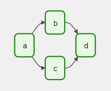
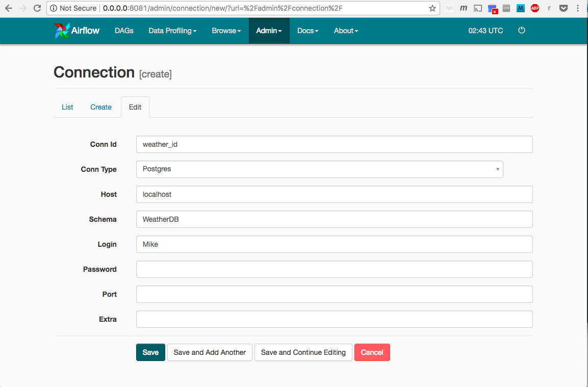

# Getting started with Airflow
## What is Apache Airflow


Apache Airflow is a workflow engine that will easily schedule and run your complex data pipelines. It will make sure that each task of your data pipeline will get executed in the correct order and each task gets the required resources.

It will provide you an amazing user interface to monitor and fix any issues that may arise


## Installation steps
Let’s start with the installation of the Apache Airflow. Now, if already have pip installed in your system, you can skip the first command. To install pip run the following command in the terminal.
```bash
sudo yum install python3-pip
```
Next airflow needs a home on your local system. By default ~/airflow is the default location but you can change it as per your requirement.
```bash
export AIRFLOW_HOME=~/airflow
```
Now, install the apache airflow using the pip with the following command.
```bash
pip3 install apache-airflow
```

Airflow requires a database backend to run your workflows and to maintain them. Now, to initialize the database run the following command.
```bash
airflow db init
```
We have already discussed that airflow has an amazing user interface. To start the webserver run the following command in the terminal. The default port is 8080 and if you are using that port for something else then you can change it.

```bash
airflow webserver -p 8080
```
Now, start the airflow schedular using the following command in a different terminal. It will run all the time and monitor all your workflows and triggers them as you have assigned.
```bash
airflow scheduler -D
```
## DAGS
DAG(Directed Acyclic Graph) is the core concept of Airflow ,involves collection of Tasks together with dependencies and relationships to say how they should run

Here is a basic example DAG



It defines four Tasks -A,B,C and D and dictates the order in which they have to run,and what tasks depend on what others.
it also shows how often the DAG is run(maybe every 5 minutes starting tomorow,or every day since January 1st,2020)

A DAG usually has a schedule,a start time and a unique ID.The tasks inside DAG's are made of operators.Operators are define what
actually run for a particular task.

## Different connections can be added under Airflow connections,below is an example for adding postgres connections

Before adding postgres connection,airflow postgres package should be installed using the below
```bash
pip install apache-airflow-providers-postgres


```
Apache spark package 
```bash
pip install apache-airflow-providers-apache-spark


```
## Interacting with Airflow API 
### The following parameters should be adjusted in the configuration file to enable the experimental Airflow REST API
```bash
endpoint_url = http://192.168.214.xxx:8081

enable_experimental_api = True

#### enabling without auth
auth_backend = airflow.api.auth.backend.default 


#### enabling with Basic auth
auth_backend = airflow.api.auth.backend.basic_auth
```

## View task Status
### Syntax
```bash
curl -X GET -H "Content-Type:application/json" -H "Accept: application/json" -d '{}' "http://192.168.214.xxxx:8081/api/experimental/dags/pyspark_etl/dag_runs"
```
### Response
```bash
{
      "dag_id":"pyspark_etl",
      "dag_run_url":"/graph?dag_id=pyspark_etl&execution_date=2021-10-18+00%3A02%3A00%2B00%3A00",
      "execution_date":"2021-10-18T00:02:00+00:00",
      "id":3744,
      "run_id":"scheduled__2021-10-18T00:02:00+00:00",
      "start_date":"2021-10-18T11:37:44.555756+00:00",
      "state":"success"
   }
```